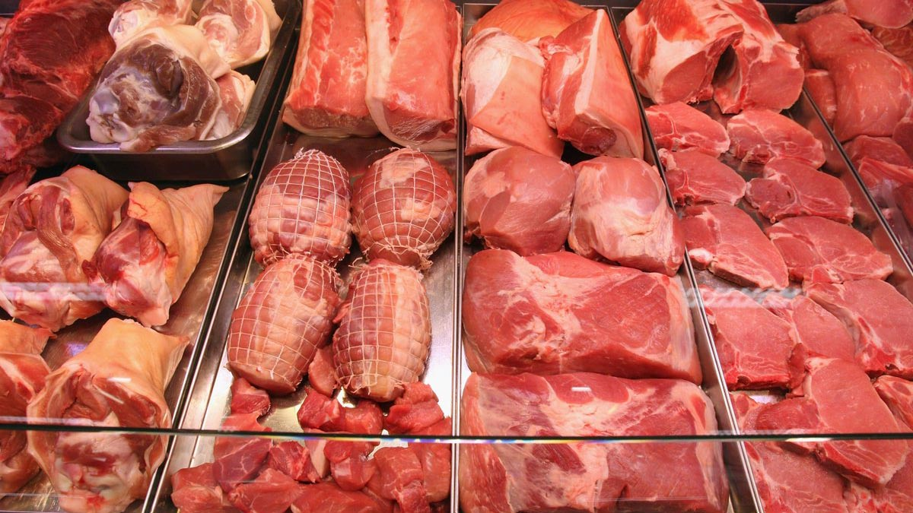

```{r setup, include=FALSE}
knitr::opts_chunk$set(echo = TRUE)
library(tidyverse)
library(plotly)
library(readr)
library(magrittr)
library(sankey)
library(networkD3)
library(alluvial)
library(ggalluvial)
library(easyalluvial)
library(riverplot)
library(echarts4r)
library(plotrix)
library(readr)
library(vcd) 
library(ggplot2)
library(DescTools) 
library("gplots")
library(ggExtra)
library(lattice)
library(dplyr)
library(corrplot)
library(hexbin)
library(aplpack)
library(highcharter)
library(ggpubr)
data_2 <- read_delim("D:/MSGSU_Istatistik/Gorsellestirme/data_2.csv", 
    ";", escape_double = FALSE, trim_ws = TRUE)
data_2 <- data_2[,-c(2,3,5,6)]
```




# *1990 - 2029 Arası Ülkelere Göre Tüketilen Et Türü Görselleştirmesi*

## *Değişkenler*

**LOCATION:** Ülkelerin ISO kodları

**SUBJECT:** Et türleri, Bunlar İnek, Domuz, Kanatlı ve Koyun olarak sınıflandırılmıştır.

**YEAR:** YIL tabanlı tarih verisi

**Value:** Tüketim Miktarları


## *Sankey Diagram*

```{r Sankey Diagram}
data_2_1<- as.data.frame(data_2, stringsAsFactors = FALSE)
head(data_2_1)
data_2_1 %>% e_charts() %>%
    e_sankey(SUBJECT, LOCATION, Value)
```

## *Alluvial Diagram*

```{r Alluvial Diagram}

ggplot(as.data.frame(data_2_1),
       aes(y = Value,
           axis1 = LOCATION, axis2 = SUBJECT, axis3 = Value,
           fill = SUBJECT)) +
  geom_alluvium() +
  scale_x_discrete(limits = c("LOCATION", "SUBJECT", "Value"))

```

## *3-D Scatter Plot*

```{r 3-D SCATTER PLOT}
plotly::plot_ly(data_2, x = ~LOCATION, y= ~SUBJECT, z= ~Value)
```

## *Bubble Plot*

```{r Bubble Plot}
ggplot(data_2, aes(LOCATION,YEAR, color=SUBJECT, size=Value))+
  geom_point(alpha=0.5)+
  theme(legend.position = "right")
```

## *Scatter Plot*

```{r Scatter Plot}
ggplot(data_2, aes(YEAR,Value))+
  geom_point(size=2,shape=21,stroke=1,color="deepskyblue3", fill="deepskyblue3")+
  geom_smooth(method = "lm", col="darkblue",se = FALSE)
```

## *Jittered Dot Chart*

```{r Jittered Dot Chart}
stripchart(data_2_1$Value, main = "Jittered Dot Chart",  xlab = "Tüketilen Et Sayısı(Kg)",
   ylab = "Miktar", method = "jitter", pch = 20)
```

```{r}
p <- ggplot(data_2_1,aes(x = Value, y = LOCATION, color=SUBJECT )) 
p + geom_jitter() # add jitter
```

## *Line Graph*

```{r Line Graph}
ggplot(data_2, aes(x = YEAR, y = Value, color = SUBJECT, group = LOCATION )) +
  geom_line() +
  geom_point()
```
